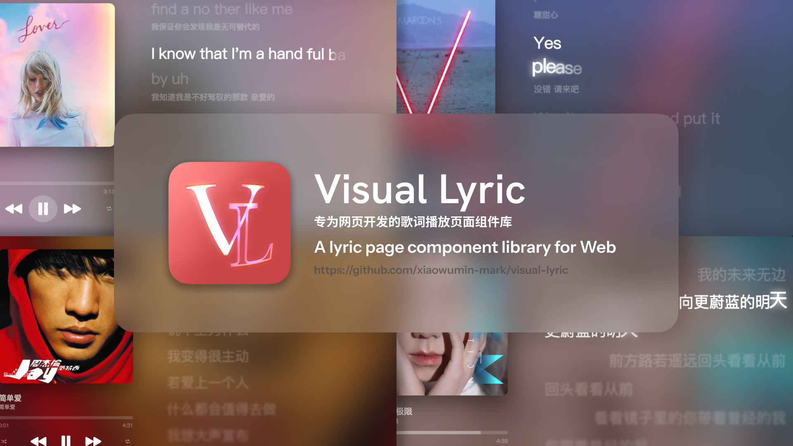

> This file has been translated using AI. Some nuances may not be perfectly captured. 
> For the most accurate information, please refer to the original Chinese version.

# Visual Lyric

---

[English](./README.md) / [简体中文](./README_zh.md)

A web-based component library for displaying lyrics, inspired by Apple Music's lyric display.

Although this project does not aim to fully replicate Apple Music, it aims to refine some details better.

### Technologies Used

- [Vite](https://vitejs.dev/)
- [Node.js](https://nodejs.org/)
- [Gsap](https://gsap.com/)

### Features Implemented

- Lyric Scrolling
- Spring Rebound Effect for Lyrics
- Word-by-word Lyrics
- Rising Word-by-word Lyrics
- Lyric Glow Effect
- Transliteration Lyrics
- Multi-track Lyrics
- Secondary Lyrics

> [!WARNING]
> The lyric display component library currently supports only desktop web browsers, not mobile devices.
> The source code does not include logic for multi-track judgment; it uses WebAssembly compiled with Go, see [Visual Lyric Goland](https://github.com/xiaowumin-mark/visual-Lyric-goland).
> Lyric parsing currently supports TTML only. For more information about TTML lyrics, see: [amll-ttml-db](https://github.com/Steve-xmh/amll-ttml-db)

### How to Use This Project (Project Development is Ongoing)

1. Install Dependencies: `npm install`
2. Run the Project: `npm run dev`
    - Create a `music` folder in the project directory.
    - Place cover images (`png`), lyric files (`ttml`), and music files (`any format`) with the same filenames inside this folder.
3. Access: `http://localhost:8081/`

### URL Parameter Details

| Parameter Name | Parameter Type | Description |
| --- | --- | --- |
| m | string | Music filename |
| t | string | Song file extension |

> Example: `http://localhost:8081/?m=ME!&t=mp3`

### Contributing to the Project

We welcome any developers to contribute to this project! If you have any questions or suggestions, please submit feedback via GitHub Issues. You can also directly submit Pull Requests to improve the code.

### License

This project is licensed under the MIT License. For more details, see the LICENSE file.

Thank you to everyone who has provided help and support for this project!

> [!NOTE] This project is still actively under development, and more features will be added and existing features will be optimized in the future.