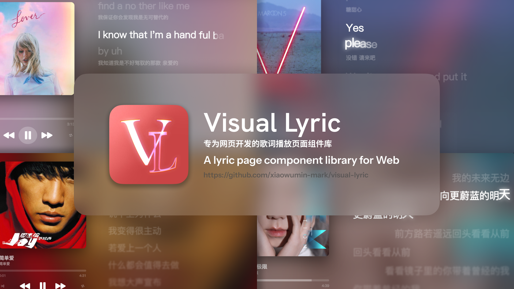

# Visual Lyric

---

[English](./README.md) / 简体中文

一个基于 Web 技术制作的类 Apple Music 歌词显示组件库

尽管这个项目的目标并非完全模仿，但是会更好地打磨一些细节

### 本项目使用的技术栈

- [Vite](https://vitejs.dev/)
- [Node.js](https://nodejs.org/)
- [Gsap](https://gsap.com/)

### 目前已实现的功能

- 歌词滚动
- 歌词弹簧回弹
- 逐字歌词
- 逐字歌词上升
- 歌词辉光效果
- 音译歌词
- 多音轨歌词
- 二级歌词

> [!WARNING]
> 歌词显示组件库目前仅支持电脑 Web 端，不支持移动端
> 源码中并没有多音轨判断的逻辑使用go编译的webassembly实现，[Visual Lyric Goland](https://github.com/xiaowumin-mark/visual-Lyric-goland)
> 歌词解析仅支持TTML,更多关于TTML歌词的内容：[amll-ttml-db](https://github.com/Steve-xmh/amll-ttml-db)

### 如何使用本项目：（本项目的开发还在进行中）

1. 安装依赖：`npm install`
2. 运行项目：`npm run dev`
    这时需要在项目文件夹下新建`music`文件夹，
    需要在里面放置相同文件名的封面图片(`png`)，歌词文件(`ttml`)，以及歌曲文件(`不限`)
3. 访问：`http://localhost:8081/`

### URL参数详解

| 参数名 | 参数类型 | 参数说明 |
| --- | --- | --- |
| m | string | 音乐文件名 |
| t | string | 歌曲文件后缀 |

> 示例：`http://localhost:8081/?m=ME!&t=mp3`

### 项目贡献

欢迎任何开发者为本项目做出贡献！如果你有任何问题或建议，请通过 GitHub Issues 提交反馈。你也可以直接提交 Pull Request 来改进代码。

### 许可证

本项目采用 MIT 许可证，详情请参阅 LICENSE 文件。

感谢所有为本项目提供帮助和支持的人们！

> [!NOTE] 本项目仍在积极开发中，未来会增加更多功能和优化现有功能。